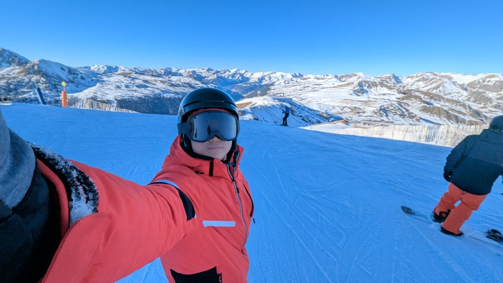

Imagínate una vida sin aficiones ni pasatiempos. Cada día vas a la oficina o, si eres estudiante, a la escuela. Trabajas de la mañana a la noche, vuelves a casa y duermes. Al día siguiente haces lo mismo y al siguiente, de nuevo. Así pasa toda la vida: un ciclo sin fin de trabajar. Suena horrible, ¿no?

Lo que falta en ese ejemplo es la diversión. Esas horas del día en las que te reclinas en el sillón y disfrutas de una novela, o en las que te esfuerzas en la pista de tenis, corriendo de un lado a otro. Es el momento en el que desaparece el estrés constante, de la continua competencia que define la sociedad en la que vivimos, y en el que podemos hacer lo que realmente queremos. Quizá sea la única parte de nuestro día, en la que no tenemos que ser productivos y en la que podemos quitarnos de encima el peso abrumador de la realidad.

 *Foto: Kenzo Tu / Unsplash — Una oficina gris y vacía*

Pues, sé que he pintado un panorama gris y aburrido, pero que entiendas la importancia de tener algo que te anime. En muchos casos, las aficiones son lo que da sentido a la vida. [Según un estudio](https://www.nature.com/articles/s41591-023-02506-1) publicada en Nature Medicine, basado en datos de más de 90.000 personas en 16 países, la participación activa en los hobbies se asocia con mayores niveles de felicidad autoreportada, satisfacción de la vida y mejor salud percibida. Aunque la mayoría de los participantes del estudio son de mayor edad, en muchos casos ya están jubilados, es plausible que los beneficios observados podrían aplicar a otros grupos, especialmente a los quienes no disfrutan de su trabajo. El estudio revela que no importa lo que seas tu hobbie, sino que participes activamente en él.

 *Una partida de baloncesto 3X3: Singapur vs. Brazil*

Otro beneficio que obtendrás casi gratis es la ampliación de tu círculo social. Muchas aficiones implican interactuar con otras personas, por ejemplo los deportes o los clubes de interés. Así puedes conocer gente nueva que comparte tus mismos intereses, y con la que es más fácil identificarte. Si bien algunos hobbies se hacen en solitario, como la lectura o el tejido, siempre existe una comunidad con ese mismo interés. Suele ser muy fácil entrar en ella, y poco a poco puedes ampliar tu entorno social.

Tal vez algunos de vosotros tengáis dudas como: «Ya me cansa el trabajo, no tengo energía para mis hobbies» o «Qué pérdida del tiempo, ¿por qué invertirlo en algo que no genera dinero?». A esas personas les invito a pensar en esto: ¿trabajamos para vivir o vivimos para trabajar?

No somos máquinas. Nos cansamos, y no es sostenible trabajar veinticuatro horas al día, siete días a la semana. Por mucho que durmamos para recuperar la energía, la mente y el alma se agotan.

Es más, en lugar de ser una pérdida de tiempo, tener hobbies te puede hacer más productivo y eficiente en el trabajo. Con una salida para el estrés, evitas la acumulación de emociones negativas que te agobian, y el agotamiento mental. Eso es clave para dar lo mejor de ti en el trabajo.

 *Snowboardear en Andorra, Grau Roig*

En mi caso, he tenido un montón de hobbies variados a lo largo de los años. Cuando era niño, me gustaba el anime (dibujos animados de japón) y los TCGs (del inglés "Trading Card Game"). Luego mi hermano me enseñó el mundo mágico de los videojuegos, del que todavía disfruto. Cuando era mayor, me obsesionaba el entrenamiento del cuerpo, y por eso hacía gimnasio y jugaba a los deportes todos los días. Hoy me encanta cantar y tocar la guitarra.

Obviamente ya no los hago todo, pero lo que quiero enseñarte es que no es importante que elegirías a hacer, y que está bien cambiarlo con la edad. Pues nada, haz lo que te haga feliz y ya tendrás un hobby 😀.
