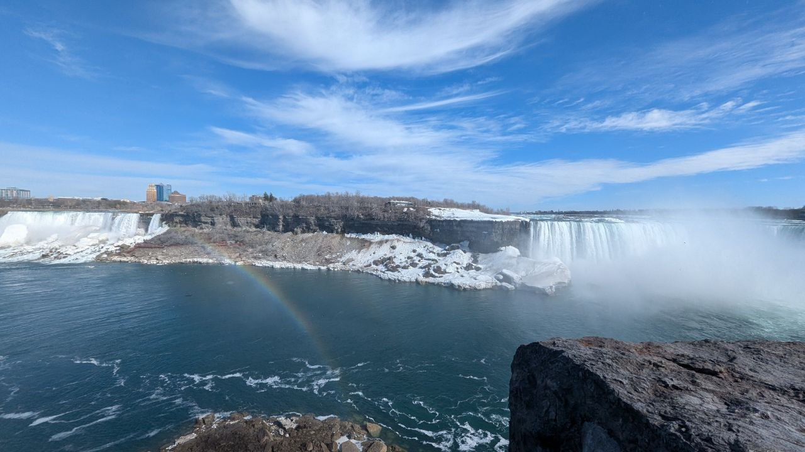

## Hola, me llamo Donovan.

Soy un chico de Singapur y tengo 24 años. Soy aventurero y nunca diría que no a nada (excepto ver películas de horror). Siempre estoy buscando nuevas experiencias, algunas que amplíen mi mente y me hagan apreciar la vida. Mis amigos me consideran una persona simpática y amable. Me encanta conocer a gente de culturas diferentes en mis viajes, siempre hay algo nuevo que me sorprende. En mi tiempo libre, desarrollo programas para mejorar mi vida. Mi proyecto actual es un Telegram Bot al que puedes decir lo que necesitas comprar y que te ayuda a comprarlo.

Chateando con el Telebot

Llevo dos años escribiendo un diario del día a día para recordar los momentos más significativos en mi vida y para reflexionar sobre mis logros y metas. El año pasado fue un año inolvidable lleno de viajes, felicidad, tristeza, sorpresas y aprendizajes. ¡Pasé casi 8 meses fuera de Singapur estudiando y trabajando! Eso me hizo pensar en contar mis historias a los demás. A tí, ya que estás leyendo el blog 😉.

Bueno en este blog voy a escribir tres tipos de publicaciones: comentarios sobre noticias mundiales, historias divertidas de mis viajes y de vez en cuando, escritos sobre cualquier tema me apetezca comentar. Voy a publicar todos los lunes y si tengo más que escribir, uno más en la semana. Gracias por leer mi primer blog post y ¡espero verte en el siguiente!

Las cataratas de Niágara, Cánada