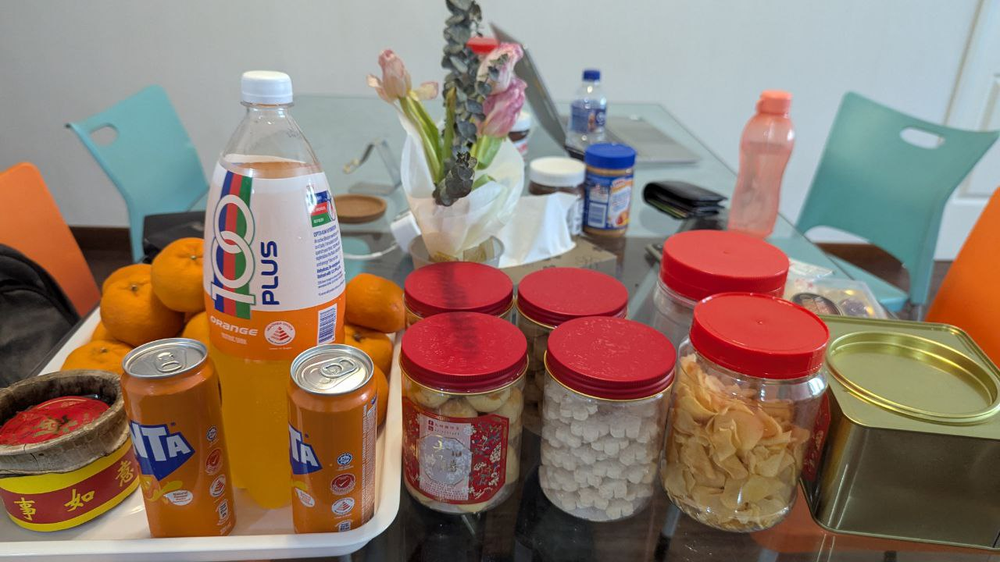
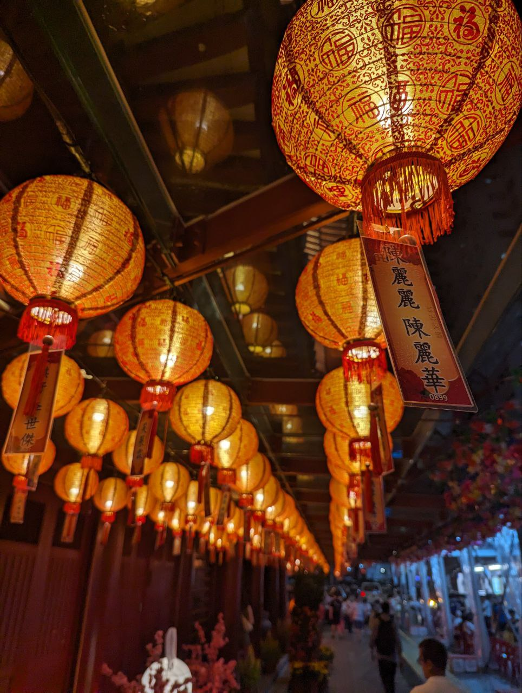

Se acerca el Año Nuevo Chino y todos los chinos estarán pensando: ¿cuánto peso ganaré y cómo consigo perderlo después? Sin duda, la comida es un aspecto imprescindible del Año Nuevo Chino. Celebramos el comienzo del año chino con una abundancia de tentempiés fritos, dulces y carne. ¿Qué significa la comida a los chinos? ¿Por qué comemos tanto a costa de nuestra salud? En este ensayo, te voy a contar el papel de la comida en las festividades del año nuevo chino.

En cuánto a las raciones de la comida, la gran cantidad y el exceso simboliza la riqueza que deseamos. En nuestra cultura, es muy importante demostrar a tu entorno que tienes dinero y que eres rico. Pienso que esto ha influido también en la tradición de comprar y comer tanto en las festividades.

Tentempiés en la casa

Además, también tienen significado los platos diferentes. ¿Sabes que los fideos simbolizan una vida larga con buena salud, o que las galletas representan el oro? Casi cada plato tiene su propio significado, y para los chinos que creen mucho en las supersticiones, es muy común comerse todos para tener buena suerte.

Como he mencionado previamente, es inevitable ganar peso en las festividades del Año Nuevo Chino. Personalmente, en la celebración del año pasado ¡gané 3 kilos en solo una semana! Es que la comida no es muy saludable. Ahora bien, en estos últimos años hemos empezado a ser más conscientes de la salud y el desperdicio de la comida. Algunas casas han empezado a comprar menos y elegir opciones más saludables, o sea con menos azúcar o frito con menos aceite. Honestamente, no me gustan las alternativas porque no tienen el mismo sabor. En cualquier caso, la insalubridad de la comida no va a disminuir su importancia.

Decoraciónes en un templo chino

En resumen, la comida tiene un gran significado en las celebraciones del Año Nuevo Chino. A pesar de que no es saludable, los chinos siguen comiéndola tanto porque representa la buena suerte. Ante todo, nos da la oportunidad de quedar con la familia para compartir una comida, y eso es lo más importante.