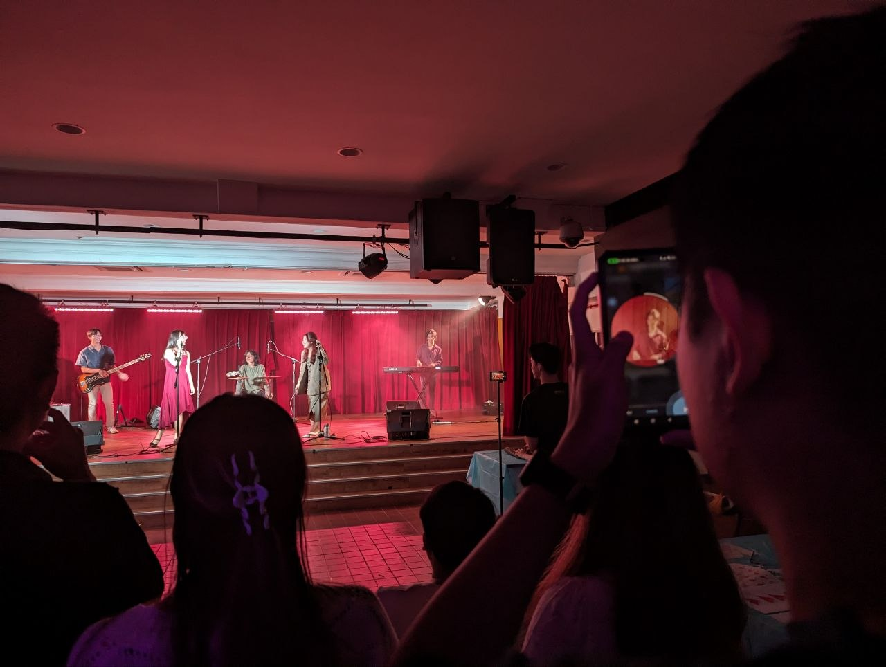
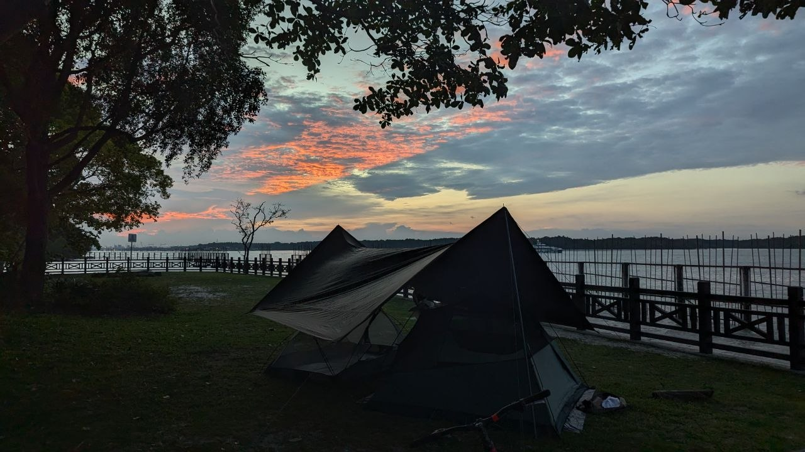

"Se acabó el tiempo. Por favor deja de escribir. Si sigues escribiendo, consideraremos que haces trampa." Un martes cualquiera, a las 5 de la tarde, oí esta instrucción por la última vez en mi vida universitaria. Justo como así, se acabó la universitaria. No sé qué estaba esperando, ¿algunas felicitaciones o una gran celebración? Estos 4 años fueron los más importantes de mi vida hasta ahora. He hecho muchos amigos a partir de estos años, y echo de menos mucho el tiempo viviendo en el dormitorio. He tenido la oportunidad de viajar por el mundo, a Europa y a Norteamérica, antes me he quedado solo en el continente asiático. He vivido experiencias inolvidables, experimentando lo que la vida ofrece, desde conociendo a mi novia hasta yendo a españa por unas prácticas, y mucho más. 

 *Una actuación por las estudiantes del dormitorio*

Por otro lado, la vida universitaria no siempre es tan bonita e idílica. Me acuerdo incontables noches quedándome despierto haciendo tareas o preparándome para los exámenes. Había períodos en los que tenía muchos exámenes y trabajo para entregar, y apenas aguantaba pensando solo en la libertad que vendría después. El segundo año fue lo peor, porque tomaba muchos cursos al mismo tiempo que tenía muchas responsabilidades como vicepresidente de 2 clubes de interés. Me costó mucho trabajo encontrar un equilibrio entre los dos, pero aprendí mucho sobre el liderazgo y de mí mismo.

Para no olvidar el propósito de este blog, voy a dejar las historias universitarias para otro día. Quiero hablar acerca de la vida después de graduarme, específicamente los sentidos y qué hago día a día.

Aunque ya no tengo nada que entregar ni hacer por la escuela, sigo sintiéndome esa sensación de ansiedad. Como ¿qué hago ahora? ¿Estoy utilizando el tiempo bien o todo es un malgasto? Eso se intensifica cuando veo que otros encuentran trabajos bien remunerados mientras yo me quedo en casa sin trabajar. Me da pena pensar en la posibilidad de que estoy perdiendo en la carrera de vida.

 *El amanecer sobre Suiza*

Pues sí, si la única medida de éxito en la vida es ganar dinero, estoy más lejos de la línea de meta que los otros. Pero no creo que esa sea nuestra misión en esta Tierra. La vida nos ofrece mucho más, como la naturaleza, el amor y simplemente el vivir, que creo que será una lástima ceder todos estos en la preocupación por el dinero. Ahora bien, no afirmo que ganar dinero sea una cosa mala. De hecho, tener dinero es una manera de lograr verdadera libertad en nuestra sociedad, y jubilarse a menor edad es algo que me gustaría. Pero ganar dinero no debería ser tu único objetivo en la vida, de lo contrario tendrás todo el dinero en el mundo pero ni el tiempo ni la conciencia para gastarlo.

En cuanto a la ansiedad por no hacer más, es algo que todavía me cuesta resolver. He reflexionado sobre este tipo de ansiedad y se puede comprender mejor si se clasifica según su origen, de dentro o de fuera. Si viene de dentro, es el cerebro contándote que le aburre y te toca cambiar la rutina. Típicamente, si haces caso de este tipo de ansiedad, lo que provendría es la pasión, el propósito, y el crecimiento. En otro caso, si viene de fuera, es importante saber bien la fuente exáctamente. Las responsabilidades son una fuente de ansiedad que es justificada y nos ayuda a ser responsables, pero lo que me da mucha ansiedad, y seguramente a muchas otras personas, es el miedo de las expectativas que no se cumplan. Este tipo es plenamente inútil y hasta dañoso porque muchas veces estas expectativas no son los demás quienes las esperan de ti, sino que las creas tú mismo y que te paralizan. Si pasas todo el tiempo sintiéndote mal por no ser productivo, no tendrías la capacidad mental para cambiarlo. Es importante evitar la ansiedad no justificada y tomar el tiempo para buscar lo que realmente quieres hacer. Si lo que quieres es relajarte y quedarte en casa, siempre y cuando no olvides tus responsabilidades, adelante.

 *Haciendo cámping en Pulau Ubin, Mamam Campamento*

Entonces, ¿qué he hecho después de graduarme? En cuanto a mis aficiones ([haz clic](/blog/beneficios-de-tener-aficiones/) para leer más sobre la importancia de las aficiones), leo mucho y veo videos en YouTube para mantener y mejorar mi nivel de español, y también juego al baloncesto más. Como hago ejercicios, también cocino bastante para consumir más proteínas, ya que la comida en Singapur no suele tener tantas. Realmente, me estoy tomando un descanso antes de empezar mi máster en septiembre. Y, por ahora, eso me parece bien.
