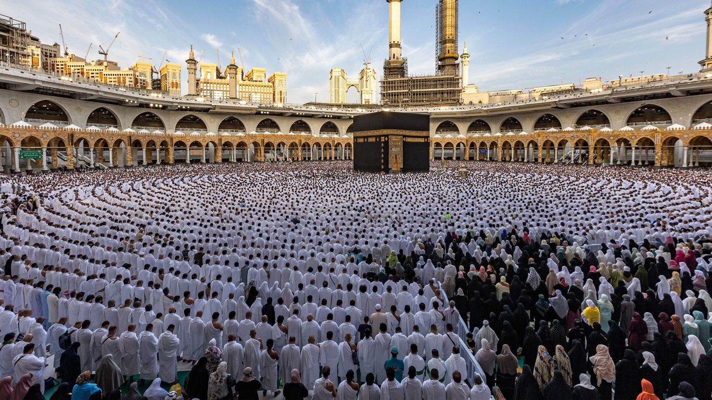

Cada año durante el mes de Ramadán, musulmanes de todo el mundo se unen con el acto de ayunar. No se permite comer ni beber nada durante las horas de sol. Para los demás que no son musulmanes, esta tradición tal vez no tiene mucho sentido. Preguntas como: ¨¿tienes que despertarte antes del amanecer para comer y orar?¨ O ¨¿ni una gota de agua?¨ son muy veas durante este mes. Incluso yo, que vivo en Singapur con una población significativa de musulmanes, sigo faltando conocimiento y comprensión de esta práctica. Sin embargo, he hecho una investigación sobre su origen y su significado para los musulmanes para conocerla mejor.

Antes que nada, Ramadán es el noveno mes del calendario islámico y se cree que la primera revelación del Qur'an al profeta islámico Muhammad ocurrió durante este mes en 610 d.C. Debido a que el calendario islámico es diferente que el calendario gregoriano que usamos hoy en día, la fecha de Ramadán cambia de año a año. Después de 29-30 días de ayuno, dependiendo del ciclo lunar, se celebra el Hari Raya Puasa marcando el fin del bendito mes de ayuno y oración.

 Laylatul Qadr: La noche de Poder

Es obligatorio que todos los adultos musulmanos participen en esta práctica a menos que estén enfermos o sean demasiado viejos y frágiles, y para las mujeres que estén embarazadas o menstruando. Cuanto a los quienes viven en lugares donde no baje el sol, siguen el horario del país más cercano donde se puede distinguir el día y la noche. En cualquier caso, es una práctica importante y respetada por todos los seguidores de la religión.

Entonces ¿qué significa la práctica de ayuno? Por un lado, el ayuno promueve el aumento de autocontrol, gratitud y compasión. Además, desarrolla un sentido de empatía para los demás, ayudándote a ser una mejor persona. Si tienes el privilegio de ayunar por un medio día y sabes que al atardecer no tendrás hambre ni sed más, piensas en los pobres que viven esa realidad todos los días sin saber de dónde viene su próxima comida. Por otro lado, un objetivo más religioso es sentir más cerca a Allah. La idea es que si uno puede controlar sus deseos humanos por Allah, entonces también puede evitar los deseos malos que lo llevan a desviarse del camino divino.

 Mecca: la ciudad más sagrada del Islam, y el lugar de nacimiento del profeta Muhammad

No sólo ayunan los musulmanes durante el Ramadán sino también intentan ser un humano de corazón más puro. Se abstienen de fumar y intimidades maritales durante el día para purificar el cuerpo. Igualmente, rezan más horas cada día y se auto reflexionan para purificar la mente y el alma. Por consiguiente, los musulmanes salen del mes siendo mucho más humilde. 
Ahora bien, tengo que confesar algo. Me intriga esta práctica y decidí ayunar por sólo un día con mi amigo musulmano. Pensaba que hacer el ayuno me ayuda a entender mejor la cultura y apreciarla más porque nunca había hecho algo así. Era muy difícil de verdad, especialmente por la tarde cuando ya hace horas que no bebía agua pero me quedaban muchas horas por atardecer. Finalmente a la hora de romper el ayuno, mis amigos y yo quedamos en un restaurante halal y esperamos la oración del radio marcando el fin del ayuno y dando permiso a todos a comer. Estoy muy agradecido por esta experiencia de hacer el ayuno y aprender la cultura de una de las religiones más importantes en Singapur. Así mismo he aprendido mucho sobre mí mismo: la fortaleza mental necesaria para autocontrolar y la gratitud que debo a mis padres por darme una vida sin preocuparme por tener comida en la mesa. 

A modo de conclusión, el mes de Ramadán es muy importante para los musulmanes de todo el mundo, durante él dejan por atrás sus deseos mundiales e intentan ser más divinos y cerca de Allah con la práctica de ayunar y rezar. Para los de vosotros que no son musulmanes, espero que tengan un mejor conocimiento de la cultura y sean más respetuosos de la religión. Si tienes la oportunidad de ayunar, inténtala. No te arrepentirás la experiencia.
